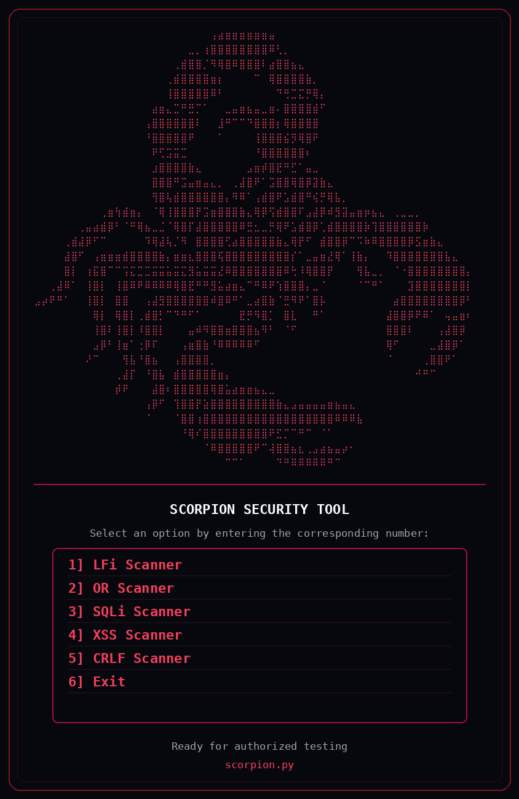
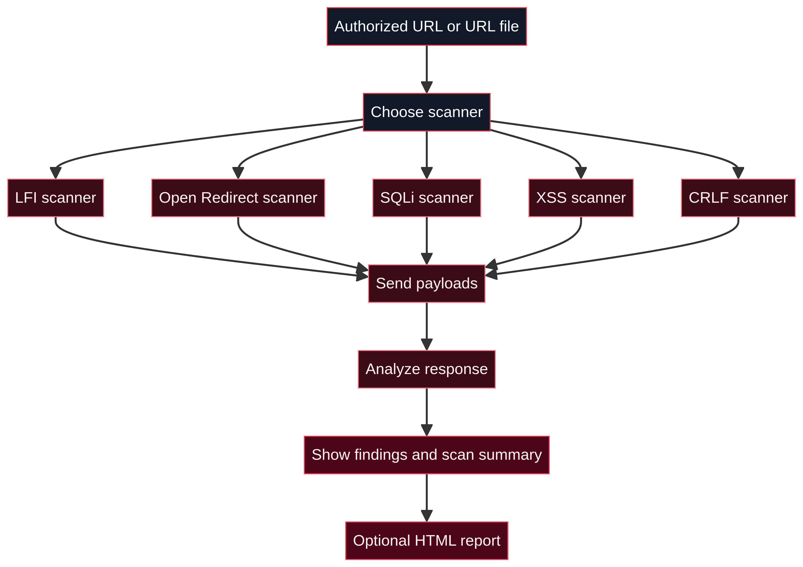
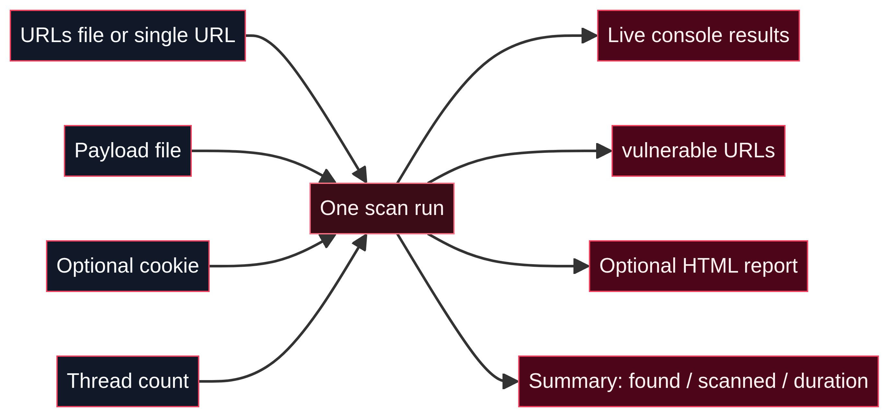

<div align="center">
  <h1>Scørp!øn ☣︎</h1>
  <p>Active web vulnerability testing tool for authorized security assessments</p>
  <p>
    
    
    
  </p>
</div>

<p align="center">
  
</p>

> ⚠️ **For authorized testing only.** Only run Scorpion against systems you own or have explicit written permission to test.

## What it does

Scorpion is an interactive CLI that sends test payloads to a URL (or a list of URLs) and checks the responses for indicators of common web vulnerabilities. A result is a lead worth verifying manually, not a final verdict.

| Scanner | Checks for |
|---|---|
| **LFI** | Local file inclusion, via path payloads and success patterns |
| **Open Redirect** | Unsafe redirects, by following the final URL |
| **SQLi** | SQL injection, via response behavior and timing |
| **XSS** | Reflected XSS, via a headless browser watching for triggered alerts |
| **CRLF** | Header/response splitting via CRLF injection |

## How it works

<p align="center">
  
</p>

## Getting started

```bash
https://github.com/0xFat7y/Scorpion.git
cd scorpion
python3 -m pip install -r requirements.txt
python3 scorpion.py
```

Pick a scanner from the menu, then provide a URL (or a file of URLs) and the payloads it asks for. No command-line flags needed.

## Input & output

<p align="center">
  
</p>

- **In:** a single URL or a text file of URLs, an optional payload file, an optional cookie, and a thread count.
- **Out:** live results in the console, a list of flagged URLs, and an optional HTML report.

## Requirements

- Python 3
- Chrome/Chromium, for the XSS and Open Redirect scanners (Selenium-driven)
- Python packages listed in [`requirements.txt`](requirements.txt)

## Responsible use

Scan only what you're authorized to test. Start with a small URL set and conservative thread counts, and confirm every finding manually before acting on it — a slow response, an alert, or a matching string is a lead, not proof.

## License

_Add a license (e.g., MIT) before publishing this repo publicly._
